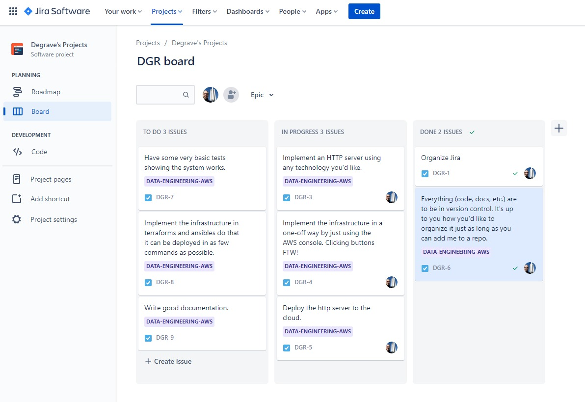
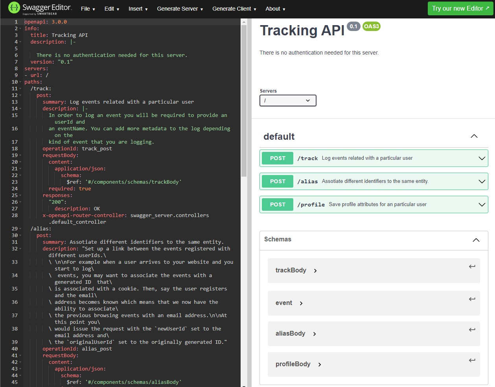
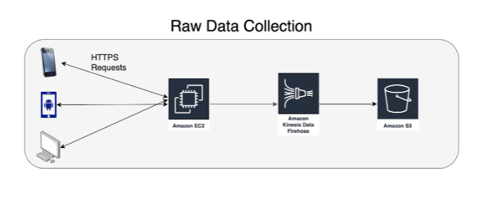
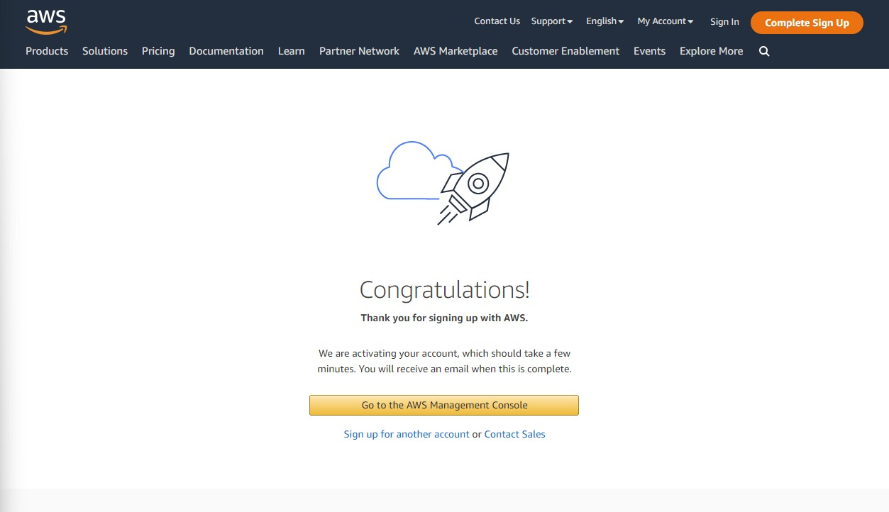
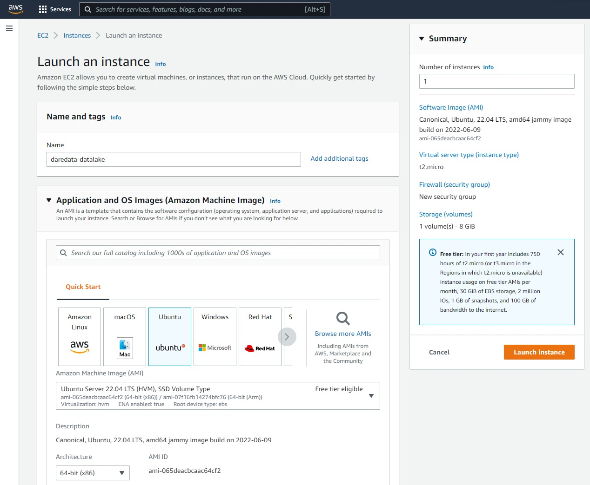
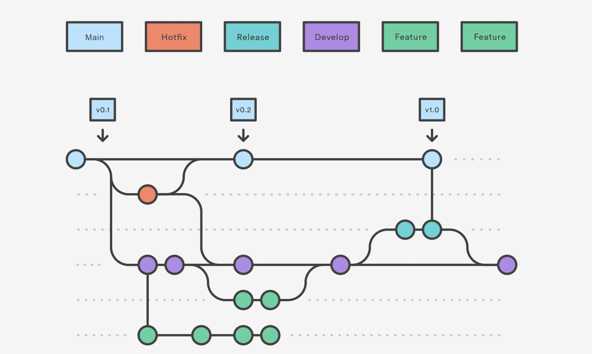

# **Documentation - Data Engineering - AWS DataLake**

TL;DR:

> This documentation file describes the process that has been followed through to implement a scalable HTTP api that writes raw data to a data lake in AWS S3 using Kinesis Firehose.

# **First things first...**

Project roadmap and tasks should be organized into some kind of development management framework.

Due to simplicity (3-day project) and small team (one-man-army), an agile Kanban was chosen to manage task completion.

As for the tool, Jira is a great one for big and small teams (free < 10 people).

# Implement an HTTP server using any technology you'd like.

Choose any well known Python framework for this, such as Django or Flask. For this project, Flask was chosen.

The HTTP Requests requirements and data structures were defined by the 'swagger.yml' reference document.

Use a tool such as Swagger Editor to visualize the request requirements:

> **POST /track** : Log events related with a particular user.

> **POST /alias** : Assotiate different identifiers to the same entity.

> **POST /profile** : Save profile attributes for an particular user.

Also, the Schemas:

> **trackBody**

> **event**

> **aliasBody**

> **profileBody**

Some tools (such as Swagger Editor) can also generate boilerplate server code, which is of great use to speed up development.

After some backend modifications to the server code, we're ready to spin-up a first prototype with working API endpoints

# Implement the infrastructure in a one-off way by just using the AWS console. Clicking buttons FTW!

**Raw Data Collection Architecture**

This portion of the architecture allows a client to collect their user's data in a cost-effective way that does not require sharing the data with or locking themselves into a 3rd party. 
 
The HTTP server will require minimal administration and should be built using a well-known and supported Python server and run on Ubuntu.

The Kinesis Firehose and S3 components are managed and require no administration.

If you don't have one already, create an AWS account.

A free-tier is available for the first 12 months with limited resources, but good enough for experimenting.

Setup an EC2 application server choosing a Linux OS (such as Ubuntu or Amazon Linux):

# Deploy the http server to the cloud.

Describe process of setting up HTTP Server in EC2 instance.

EC2 Production Environment URL endpoint: http://ec2-3-70-229-217.eu-central-1.compute.amazonaws.com:8080

# Everything (code, docs, etc.) are to be in version control. It's up to you how you'd like to organize it just as long as you can add me to a repo.

For version control, a free Git software such as GitHub was chosen and a repository was created:

https://github.com/jonasdegrave/data-engineering-aws

This way, it was possible to manage a continuous development of the project while saving checkpoints to the remote repository, comparing differences between files and logging gradual changes that were added to the project.

These basic commands should get you going:

https://education.github.com/git-cheat-sheet-education.pdf

In larger projects, however, a working workflow should be established with the team for simultaneous development of different branch features with your work colleagues and separate 'development', 'testing' and 'production' branches.

# Have some very basic tests showing the system works.

Describe HTTP Requests testing features

Use Swagger UI to test API endpoints in production EC2: http://ec2-3-70-229-217.eu-central-1.compute.amazonaws.com:8080/ui/

# Implement the infrastructure in terraforms and ansibles do that it can be deployed in as few commands as possible.

TBD

# Write good documentation.

This 'Documentation.md' file documents the process.