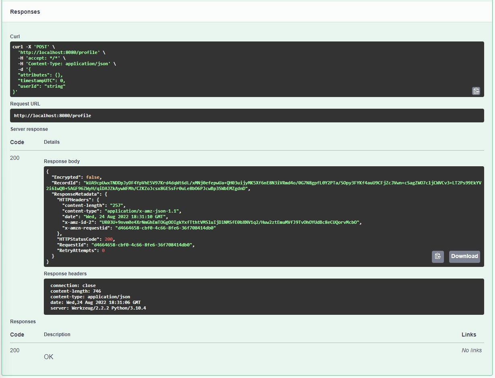

# **Documentation - Data Engineering - AWS DataLake**

TL;DR:

> This documentation file describes the process that has been followed through to implement a scalable HTTP api that writes raw data to a data lake in AWS S3 using Kinesis Firehose.

# **First things first...**

Project roadmap and tasks should be organized into some kind of development management framework.

Due to simplicity (3-day project) and small team (one-man-army), an agile Kanban was chosen to manage task completion.

As for the tool, **Jira** is a great one for big and small teams (free < 10 people).

Throught the project, you can always benchmark progress and track your work as you progress:

# **Implement an HTTP server using any technology you'd like.**

Choose any well known Python framework for this, such as Django or Flask. For this project, Flask was chosen.

The HTTP Requests requirements and data structures were defined by the 'swagger.yml' reference document.

Use a tool such as Swagger Editor to visualize the request requirements:

> **POST /track** : Log events related with a particular user.

> **POST /alias** : Assotiate different identifiers to the same entity.

> **POST /profile** : Save profile attributes for an particular user.

Also, the Schemas:

> **trackBody**

> **event**

> **aliasBody**

> **profileBody**

Some tools (such as Swagger Editor) can also generate boilerplate server code, which is of great use to speed up development.

After some backend modifications to the server code, we're ready to spin-up a first prototype with working API endpoints that return '200 OK' code indicating successful requests.

# **Implement the infrastructure in a one-off way by just using the AWS console. Clicking buttons FTW!**

**Raw Data Collection Architecture**

This portion of the **architecture** allows a client to **collect** their user's **data** in a cost-effective way that does not require sharing the data with or locking themselves into a 3rd party. 
 
The **HTTP server** will require minimal administration and should be built using a well-known and supported **Python server** and run on **Ubuntu**.

The **Kinesis Firehose** and **S3** components are managed and require no administration.

If you don't have one already, create an **AWS account**.

A free-tier is available for the first 12 months with limited resources, but good enough for experimenting.

First, configure your **AWS VPC Network** in which your applications shall operate:

Setup an **AWS EC2 Application** server choosing a Linux OS (such as Ubuntu or Amazon Linux):

Setup the **AWS S3 Bucket** which we shall use as a data lake:

Finally, the middle piece: setup the **AWS Kinesis Firehose** to funnel data from the EC2 Application into the S3 Bucket:

# **Deploy the http server to the cloud.**

Now that you have a working EC2 instance, connect to it via SSH.

You can then verify and confirm some of the **machine specifications** with a few basic Linux commands:

> **lscpu** : Verifies CPU configuration

> **free -m** : Verifies available RAM

> **df -h** : Verifies available Disk space

Now, manually clone your git repository into the remote machine to have a working prototype of the HTTP Server running in the AWS EC2 machine:

Also remember to correctly install AWSCLI and configure it in these files (region and key credentials):

> **~/.aws/config**

> **~/.aws/credentials**

A more in-depth tutorial for configuring AWS CLI can be found here:

https://docs.aws.amazon.com/cli/latest/userguide/cli-chap-configure.html

Remember to install your project library dependencies, here this was achieved by creating this shell script:

> **server-config.sh**

To run the server, another shell script was created that triggers **Git Pull** for project updates and runs **server-config.sh** first to solve any new dependencies:

> **server-run.sh**

Finally, the EC2 environment URL endpoint is up and running:

http://ec2-3-70-229-217.eu-central-1.compute.amazonaws.com:8080

# **Everything (code, docs, etc.) are to be in version control. It's up to you how you'd like to organize it just as long as you can add me to a repo.**

For version control, a free Git software such as **GitHub** was chosen and a repository was created:

https://github.com/jonasdegrave/data-engineering-aws

This way, it was possible to manage a continuous development of the project while saving checkpoints to the remote repository, comparing differences between files and logging gradual changes that were added to the project.

These basic commands should get you going with Git:

https://education.github.com/git-cheat-sheet-education.pdf

In larger projects, however, a working workflow should be established with the team for simultaneous development of different branch features without conflicting with your work colleagues, and with separate 'development', 'testing' and 'production' branches.

# **Have some very basic tests showing the system works.**

To **test** the integrated structure of the **Python Flask HTTP Server** with the **AWS EC2 + Kinesis Firehose + S3 pipeline**, a few manual tests were conducted.

Initially, a few **dummy data requests** were passed around and **verified the working integrity of the AWS pipeline**.

Data packets are verified to have arrived in S3.

Files are available for download and manual inspection:

**Then, the Swagger UI was used to test API endpoints in production EC2:**

http://ec2-3-70-229-217.eu-central-1.compute.amazonaws.com:8080/ui/

**For each API endpoint, requests were made and the data was later verified to have correctly arrived in our S3 data lake.**

> /alias

> /profile

> /track

Data verification in S3:

# **Implement the infrastructure in terraforms so that it can be deployed in as few commands as possible.**

With **Terraform**, you can implement Infrastructure as a Service (Iaas) to quickly create and destroy your hardware in the cloud.

This is useful for distributing your solution to different clients, scale it with scripts as needed and allow for great flexibility without the usage of graphical interface buttons.

> **Terraform apply** to create infrastructure.

> **Terraform destroy** to quickly destroy and remove that same infrastructure, should you so wish.

# **Write good documentation.**

This '**Documentation.md**' file documents the development process:

# **Final Remarks!**

* It's not about what you **already know**, but about what you can **learn and deploy** quickly! :-)

* Be **careful** when tinkering with AWS and Terraform scripts, you don't want to inadvertently start any 'large' AWS instances and forget them running for 10 days. This costly mistake might teach a bitter lesson. :-(

* Its easier to document anything if you take pictures during the whole process, and not at the end. Also, separating some time for documentation is always FTW! (happier work mates)

* Time management is key in any project. If you don't finish 100% of everything, don't worry. **Deploy** that working 90% and **reorganize** (with TODO's) the remaining 10% for the next development cycle. That's why it's called 'Agile' development anyways.

* Remember to have fun and always keep learning. Glad for having both this time! :-)